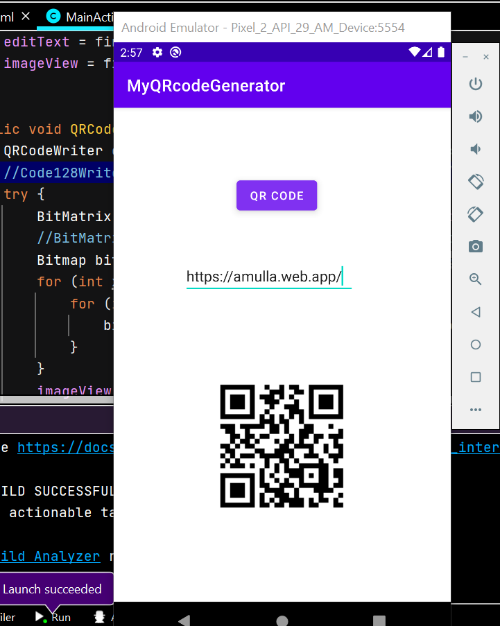

# Android QR-code generator app
## About:
> Android App that takes text input and produces QR-code for that text. It uses XML and Java using Android Studio IDE. QR-code is generated using ZXing library

## Tech used:
* Front-end: XML
* Backend: Java, ZXing library

## About ZXing library:
ZXing ("zebra crossing") is an open-source, multi-format 1D/2D barcode image processing library implemented in Java, with ports to other languages.
> For more reference visit [link](https://github.com/zxing/zxing "ZXing reference")

## Output:

